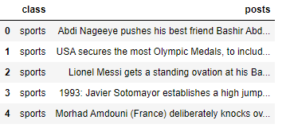

# Topic Detection and Text Classification

# Introduction

Topic Detection and Text Generation is a project in which a topic of a text is predicted (Sport, Technology and Politics category) by fine-tuning pre-trained AWD_LSTM Algorithm (implemented using Deep Learning Library [Fast.ai](http://fast.ai/)) and text is generated by using pre-trained GPT-2 Algorithm.

# Installing Dependencies

To install all the required dependencies to run the Web Application and Flask-Restful API, run the following command in the terminal

```python
pip install -r requirements.txt
```

# Pulling Docker Image

# Data Scrapping From Reddit

- Dataset for Text Classification is collected using praw library, and data is organized into trainable form after data cleaning.
- To use praw, you need to get access to client_id, client_secret, and user_agent from [https://www.reddit.com/prefs/apps/](https://www.reddit.com/prefs/apps/)



# Text Classification Using Fast.ai

Text Classification consists of the following part:

- Data Preprocessing in which stopwords (is, am, are, etc.) are removed
- Training Language Model with the collected dataset using Transfer Learning of AWD_LSTM Algorithm of [fast.ai](http://fast.ai/)
- After fine-tuning the learning rate, **38%** accurate language model is achieved
- Training classifier on the top of trained language model
- After fine-tuning the learning rate, **91.82%** accurate text classifier is achieved
- Confusion matrix of the trained Text Classifier


# Text Generation Using GPT-2

Pretrained GPT-2 model is loaded using PyTorch Deep Learning Library, which receives text as an input and generate 200 words of text as an output 

**Input** 


**Output** 


# Structure of Application

After training the Text classifier and Text generator, trained models are dumped into a .pkl format using pickle package. Trained models are then loaded and the category of the input is detected using Text Classifier and then the 200 words are generated from the input using Text Generator. It is ensured that the generated text is unique by comparing the generated text with all the previous generated text which is stored in the MongoDB Database.


# Web Application using Flask

To run the Web Application run the following command in your terminal 

```python
python text_gen.py
```

# API Implemented using Flask-Restplus

To run the API run the following command in your terminal

```python
python text_gen.api 
```